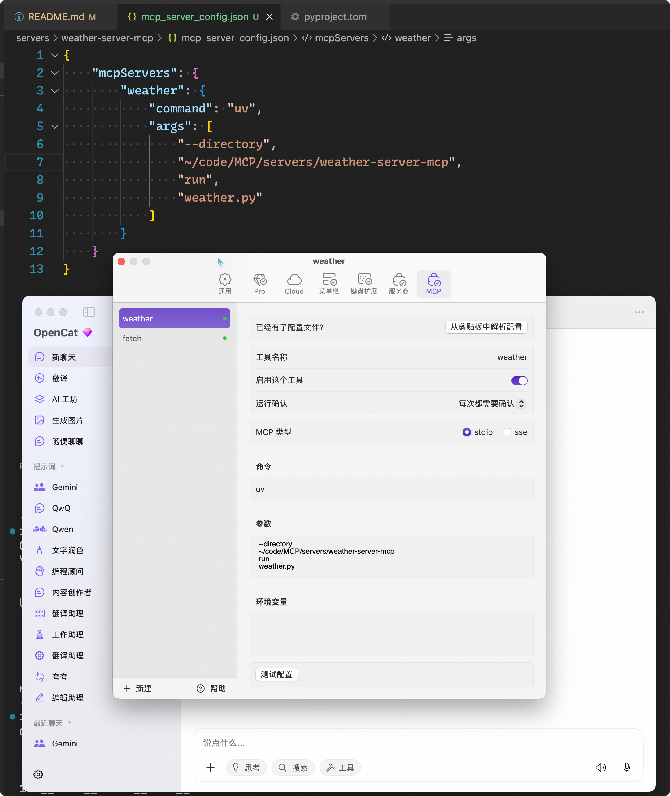
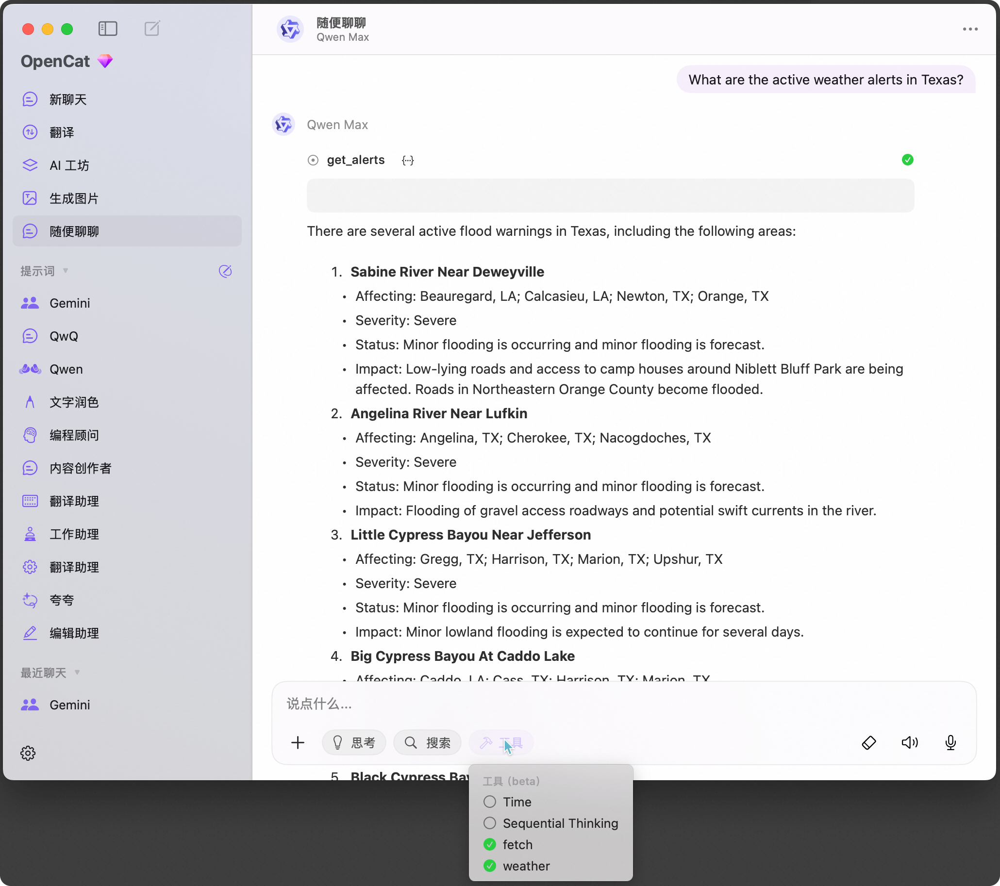
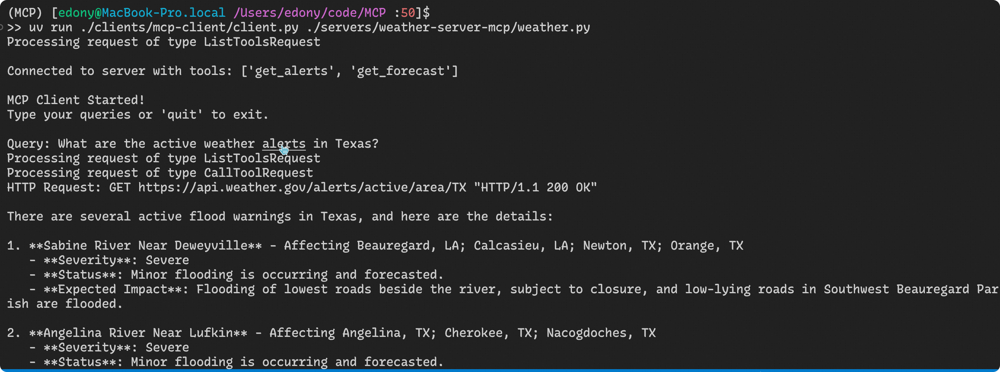

# MCP
Personal MCP Servers and Clients for LLM

## Setup
1. init the project with `uv`
```bash
uv init --python=3.10 .
touch .gitignore .env
cat << EOF >> .gitignore
.env
.venv/
__pycache__/
EOF
```
2. init python virtual environment
```bash
uv venv
source .venv/bin/activate
```
3. install dependencies
```bash
uv add dashscope httpx mcp python-dotenv langchain langchain-core langchain-mcp-adapters langchain-community langgraph
```

## MCP Server
### MCP Server Weather
This is the MCP server for the Weather service to get US weather data.

#### Project
```bash
# Create a new directory for our project
mkdir -p servers/weather-server-mcp

# Create virtual environment and activate it
uv venv
source .venv/bin/activate

# Create our server file
cd servers/weather-server-mcp
touch weather.py
```

#### Run
1. Copy the server configuration file from the MCP Host, e.g. OpenCat

2. Select the tool of this MCP server(weather)
3. Chat in the Host, e.g. OpenCat


## MCP Client
### MCP Client for Weather Server
This is the MCP client for the Weather service to get US weather data.

#### Project
```bash
# Create project directory
mkdir -p clients/mcp-client

# Create virtual environment
uv venv
# Activate virtual environment
source .venv/bin/activate

# Create our main file
cd clients/mcp-client
touch clients/mcp-client/client.py
```

#### Run
```bash
# to run the client which is connected to the weather mcp server
uv run ./clients/mcp-client/client.py ./servers/weather-server-mcp/weather.py
```

